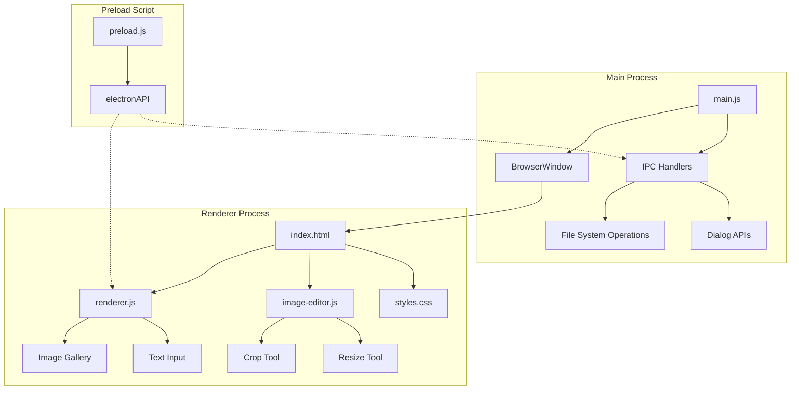
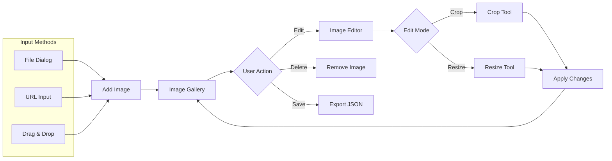
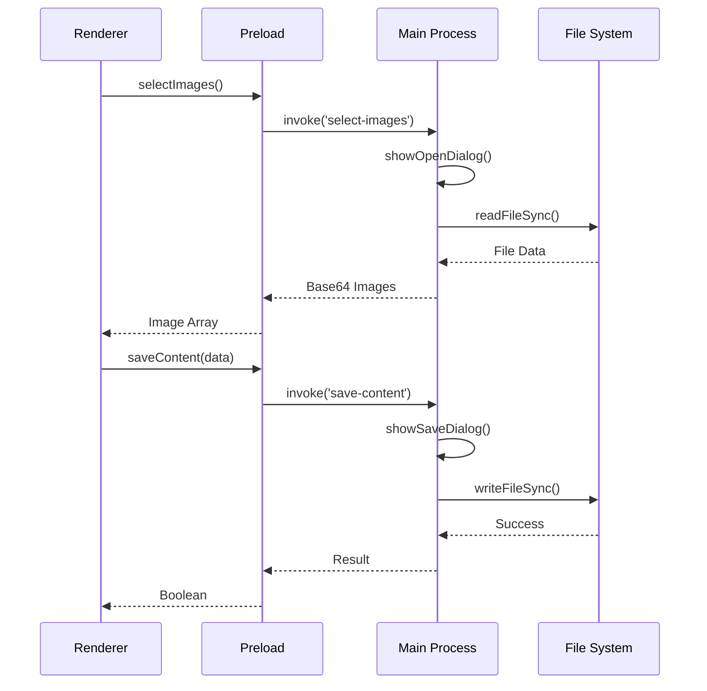
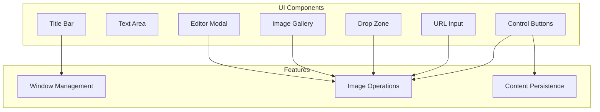

# Popup Image App

A lightweight, elegant floating popup application built with Electron for displaying images and text. Features a frameless, always-on-top window with drag-and-drop support, image editing capabilities, and content persistence.

## Features

- **Floating Window** - Frameless, transparent, always-on-top popup that stays visible while you work
- **Image Management** - Add images from local files, URLs, or via drag-and-drop
- **Built-in Editor** - Crop and resize images directly within the app
- **Text Notes** - Add text alongside your images
- **Save/Load** - Export and import your content as JSON files
- **Cross-Platform** - Works on Windows, macOS, and Linux

## Architecture



## Application Flow



## IPC Communication



## Project Structure

```
popup-image-app/
├── main.js              # Electron main process
├── preload.js           # Context bridge for IPC
├── package.json         # Project configuration
├── renderer/
│   ├── index.html       # Main HTML structure
│   ├── styles.css       # Application styles
│   ├── renderer.js      # UI logic and state management
│   └── image-editor.js  # Crop and resize functionality
└── assets/              # Application assets
```

## Installation

### Prerequisites

- [Node.js](https://nodejs.org/) (v16 or higher)
- npm (comes with Node.js)

### Setup

1. Clone the repository:
   ```bash
   git clone https://github.com/ChanMeng666/popup-image-app.git
   cd popup-image-app
   ```

2. Install dependencies:
   ```bash
   npm install
   ```

3. Run the application:
   ```bash
   npm start
   ```

## Usage

### Window Controls

| Control | Description |
|---------|-------------|
| Pin Icon | Toggle always-on-top mode |
| Minimize | Minimize window to taskbar |
| Close | Close the application |
| Title Bar | Drag to move the window |

### Adding Images

1. **From File**: Click "Add Image" button and select images from your file system
2. **From URL**: Click "Add from URL", enter the image URL, and click "Add"
3. **Drag & Drop**: Drag image files directly onto the drop zone

### Editing Images

1. Click on any image in the gallery to open the editor
2. Choose between **Crop** or **Resize** mode
3. For cropping: Drag to position the crop area, use corner handles to resize
4. For resizing: Enter new dimensions (aspect ratio lock available)
5. Click "Apply" to save changes or "Cancel" to discard

### Saving and Loading

- **Save**: Click "Save" to export all content (text + images) as a JSON file
- **Load**: Click "Load" to import previously saved content

## Component Overview



## Technology Stack

| Technology | Purpose |
|------------|---------|
| Electron | Cross-platform desktop application framework |
| HTML5 Canvas | Image editing and manipulation |
| CSS3 | Modern styling with gradients and animations |
| JavaScript ES6+ | Application logic and state management |

## Security

The application implements several security best practices:

- **Context Isolation**: Enabled to prevent renderer access to Node.js
- **Node Integration**: Disabled in renderer process
- **Content Security Policy**: Restricts resource loading
- **Preload Script**: Secure IPC communication via context bridge

## Contributing

Contributions are welcome! Please feel free to submit a Pull Request.

1. Fork the repository
2. Create your feature branch (`git checkout -b feature/AmazingFeature`)
3. Commit your changes (`git commit -m 'Add some AmazingFeature'`)
4. Push to the branch (`git push origin feature/AmazingFeature`)
5. Open a Pull Request

## License

This project is licensed under the MIT License - see the [LICENSE](LICENSE) file for details.

## Acknowledgments

- Built with [Electron](https://www.electronjs.org/)
- Inspired by the need for a simple, floating image reference tool

---

<!-- CHAN MENG PERSONAL BRAND -->
<div align="center">
  <a href="https://github.com/ChanMeng666" target="_blank">
    
  </a>

  <p><strong>Chan Meng</strong><br/>Need a custom app like this one? I build them — let's talk.</p>

  <a href="mailto:chanmeng.dev@gmail.com"></a>
  <a href="https://github.com/ChanMeng666"></a>
</div>
<!-- /CHAN MENG PERSONAL BRAND -->
